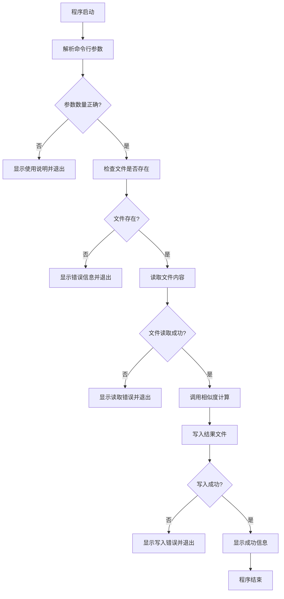
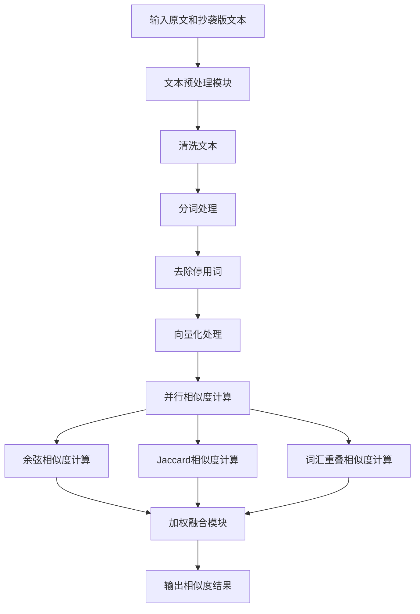
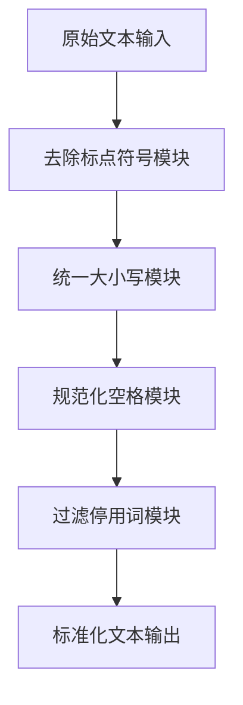

# 论文查重系统 - 项目报告

| 项目信息 | 详情 |
|---------|------|
| **课程** | [软件工程](https://edu.cnblogs.com/campus/gdgy/Class34Grade23ComputerScience?filter=homework) |
| **作业要求** | [个人编程作业](https://edu.cnblogs.com/campus/gdgy/Class34Grade23ComputerScience/homework/13477) |
| **项目目标** | 实现一个论文查重程序，规范软件开发流程，熟悉Github进行源代码管理和学习软件测试 |
| **GitHub仓库** | [https://github.com/ymxc152/3123004462](https://github.com/ymxc152/3123004462) |

---

## 1. PSP表格

| PSP2.1 | Personal Software Process Stages | 预估耗时（分钟） | 实际耗时（分钟） |
|:---|:---|:---:|:---:|
| **Planning** | **计划** | **10** | **8** |
| · Estimate | · 估计这个任务需要多少时间 | 10 | 8 |
| **Development** | **开发** | **325** | **283** |
| · Analysis | · 需求分析 (包括学习新技术) | 60 | 45 |
| · Design Spec | · 生成设计文档 | 30 | 35 |
| · Design Review | · 设计复审 | 15 | 10 |
| · Coding Standard | · 代码规范 (为目前的开发制定合适的规范) | 10 | 15 |
| · Design | · 具体设计 | 20 | 30 |
| · Coding | · 具体编码 | 150 | 120 |
| · Code Review | · 代码复审 | 30 | 20 |
| · Test | · 测试 (自我测试, 修改代码, 提交修改) | 10 | 8 |
| **Reporting** | **报告** | **60** | **68** |
| · Test Repor | · 测试报告 | 35 | 40 |
| · Size Measurement | · 计算工作量 | 15 | 8 |
| · Postmortem & Process Improvement Plan | · 事后总结, 并提出过程改进计划 | 10 | 15 |
| | **· 合计** | **395** | **354** |

---

## 2. 项目概述

### 2.1 项目简介
本项目是一个基于Python开发的论文查重系统，采用模块化设计，支持命令行和Web界面两种使用方式。系统通过多种相似度算法计算两篇论文的重复率。

### 2.2 技术特点
- **多算法融合**：结合余弦相似度、Jaccard相似度和词汇重叠相似度
- **中文文本处理**：使用jieba进行中文分词，支持中文停用词过滤
- **模块化架构**：清晰的模块划分，便于测试和维护
- **完善的异常处理**：处理各种边界情况和异常情况
- **自动化测试**：单元测试、批量测试和综合测试的完整测试体系
- **作业规范符合**：严格按照作业要求实现输入输出格式和性能要求

### 2.3 作业规范实现
- **输入输出规范**：严格按照命令行参数传递绝对路径，输出文件只包含相似度数值
- **性能要求**：5秒内完成计算，内存使用不超过2048MB
- **错误处理**：完善的异常处理机制，提供清晰的错误提示
- **安全要求**：不连接网络，不读写其他文件，不影响系统安全

---

## 3. 模块接口与设计

### 3.1 整体架构设计

本项目采用**模块化设计**，将论文查重系统分解为多个独立且功能明确的模块，便于维护、测试和扩展。

```
论文查重系统
├── main.py                    # 主入口程序
├── src/                       # 核心算法模块
│   ├── algorithm.py          # 相似度计算核心模块
│   ├── text_processor.py     # 文本预处理模块
│   ├── similarity_calculator.py # 相似度计算算法模块
│   ├── file_utils.py         # 文件处理工具模块
│   ├── result_formatter.py   # 结果格式化模块
│   └── report_generator.py   # 报告生成模块
├── tests/                     # 测试模块
│   ├── test_algorithm.py     # 单元测试
│   └── test_batch.py         # 批量测试
├── web/                      # Web界面模块
│   └── app.py               # Flask应用
├── data/                     # 测试数据目录
└── output/                   # 输出结果目录
```

### 3.2 核心算法流程图

#### 3.2.1 主程序流程图



#### 3.2.2 文本相似度计算流程



#### 3.2.3 文本预处理流程



### 3.3 核心模块接口说明

#### 3.3.1 相似度计算核心模块 (`src/algorithm.py`)

**主函数接口：**
```python
def calculate_similarity(text1, text2):
    """
    计算两段文本的相似度（主入口函数）
    
    Args:
        text1 (str): 原文文本
        text2 (str): 抄袭版文本
    
    Returns:
        float: 相似度值 (0.0-1.0)
    """
```

**功能特点：**
- 整合文本预处理和相似度计算
- 使用多种算法计算相似度并取平均值
- 返回0.0-1.0范围的相似度值
- 处理边界情况和异常输入

#### 3.3.2 文本预处理模块 (`src/text_processor.py`)

**核心函数接口：**
```python
def preprocess_text(text):
    """完整的文本预处理流程"""
    
def clean_text(text):
    """清洗文本，去除特殊字符和多余空格"""
    
def tokenize_text(text):
    """对文本进行分词处理"""
    
def remove_stop_words(words):
    """去除停用词"""
    
def vectorize_text(text):
    """将文本转换为向量表示（词频向量）"""
```

**功能特点：**
- 支持中文文本处理
- 使用jieba进行中文分词
- 内置中文停用词库
- 文本清洗和标准化

#### 3.3.3 相似度计算算法模块 (`src/similarity_calculator.py`)

**核心函数接口：**
```python
def cosine_similarity(vec1, vec2):
    """计算余弦相似度"""
    
def jaccard_similarity(set1, set2):
    """计算Jaccard相似度"""
    
def word_overlap_similarity(words1, words2):
    """计算词汇重叠相似度"""
```

**算法特点：**
- 余弦相似度：基于向量夹角计算
- Jaccard相似度：基于集合交集计算
- 词汇重叠相似度：基于词汇重叠度计算
- 多算法融合提高准确性

#### 3.3.4 文件处理工具模块 (`src/file_utils.py`)

**核心函数接口：**
```python
def read_file(file_path):
    """读取文件内容"""
    
def write_result(file_path, original_file, plagiarized_file, similarity):
    """写入结果到文件"""
    
def generate_output_filename(original_file, plagiarized_file, output_file):
    """生成带时间戳的输出文件名"""
```


